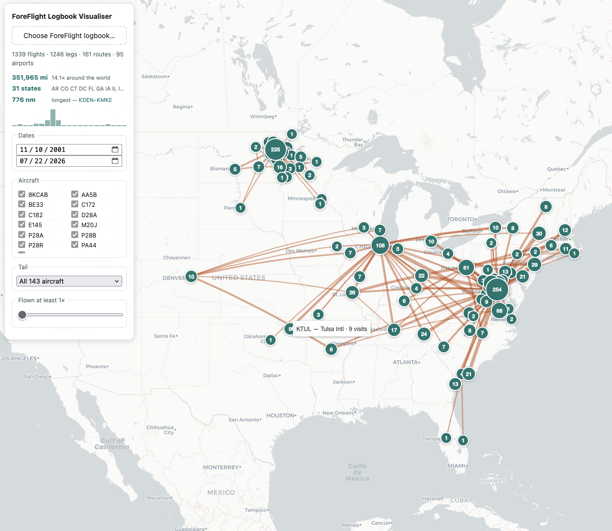

# ForeFlight Logbook Visualizer

Maps a ForeFlight logbook: where you have flown, and how often.

Pick your logbook CSV and it renders in the browser — one weighted line per airport pair, one numbered dot per airport,
filtered by date, aircraft type, or how often a route was flown. The file never leaves your machine.

```sh
npm install
npm run dev
```

Export from ForeFlight with **Logbook → Share → Export**, then load the CSV.



## Docker

```sh
docker build -t foreflight-logbook-visualizer .
docker run -p 8080:80 foreflight-logbook-visualizer
```

Node builds it, Caddy serves it — 86 MB, no Node in the running image. Logbook CSVs are excluded from the build context: they are personal data and must never end up in an image.

CI (`.gitea/workflows/build.yml`) runs tests and a type-checked build on every push and pull request. Pushing a `v*`
tag additionally builds `scr.siteworxpro.com/foreflight-logbook-visualizer` for amd64 and arm64 and pushes it.

## Docs

- [CONTEXT.md](./CONTEXT.md) — what the terms mean. Read this before changing derivation logic; the difference between a
  **Visit**, a **Leg** and a **Route** is load-bearing.
- [docs/plan.md](./docs/plan.md) — the agreed design, and the things that were deliberately left out.
- [docs/adr/](./docs/adr/) — why airport coordinates are bundled, and why there is no backend.

## Commands

|                    |                                                                                 |
|--------------------|---------------------------------------------------------------------------------|
| `npm run dev`      | Dev server                                                                      |
| `npm run build`    | Type-check and build                                                            |
| `npm test`         | Derivation tests. Set `LOGBOOK=<path.csv>` to also check against a real logbook |
| `npm run airports` | Regenerate `public/airports.json` from `Airports.geojson`                       |

`Airports.geojson` is the FAA ADIP export — a build-time source, neither shipped nor committed (13 MB). Only the pruned
`public/airports.json` reaches the browser, and it *is* committed, so a fresh clone builds and runs without it.

To regenerate, search for the **Airports** layer at <https://adds-faa.opendata.arcgis.com/search>, download it as
GeoJSON, save it as `Airports.geojson` in the repo root, and run `npm run airports`. The right layer is the one whose
features carry `IDENT`, `ICAO_ID` and `TYPE_CODE` properties.
